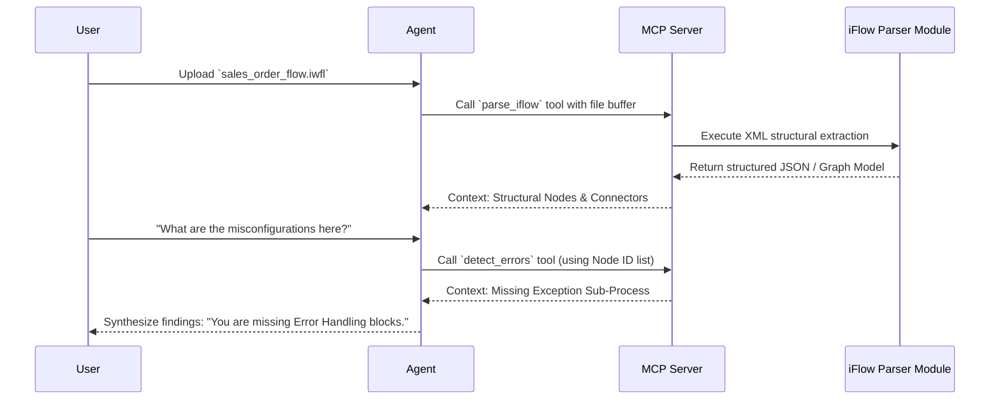

# Data Flow and Information Architecture

Understanding the complete lifecycle of how a user's query and a `.iwfl` file are processed is essential to leveraging the agent efficiently.

## Core Processing Lifecycle

The analysis follows a strict flow to ensure security, accuracy, and efficiency. Below is an overview of the typical execution sequence.

## Input & Ingestion Stage

### 1. File Upload
The `.iwfl` archive is ingested by the frontend interface. The archive represents a ZIP format containing metadata, BPMN XML files, and adapter configurations.

### 2. File Sandboxing
The data is immediately mapped into an isolated file volume. Sandboxing guarantees that files cannot invoke arbitrary remote scripts or read any environment variables outside their permitted directory.

## Analysis & Execution Stage

### 3. Tool Routing Strategy
The Agent infers exactly what deterministic functions must run based on the question. Instead of reading the 5,000-line XML string, it asks the MCP Server to run the `get_node_by_name` tool or `map_dependencies` tool to fetch narrow, relevant JSON metadata.

### 4. Graph Construction
Beneath the hood, the MCP server translates the XML representation of the SAP CPI flow into a Directed Acyclic Graph (DAG), mapping `Senders`, `Adapters`, `Process Steps`, and `Receivers`.

## Synthesis & Output Stage

### 5. Insight Generation
The Agent receives structured findings (e.g., node IDs and configuration mismatches) from the server. It layers in its advanced language generation capabilities to articulate the problem clearly to the user.

### 6. Warnings & Recommendations
Outputs are categorized clearly:
- **Insights:** Explanations of logic.
- **Warnings:** Potential performance degradations.
- **Recommendations:** Specific actions the developer should take to fix errors, backed by technical evidence extracted directly from the graph model.

> [!IMPORTANT]
> The Agent acts as an orchestrator. It does **not** process the entire XML file directly in memory within a single context window to prevent truncation and hallucinations.

---

[⬅️ Previous: Architecture Overview](index.md) | [Next: Security Model ➔](../security/index.md)
