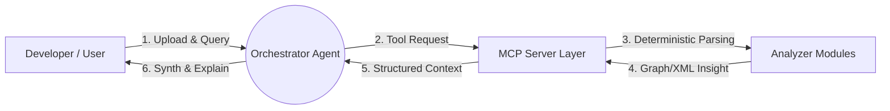

# Architecture Overview & System Design

The **CPI iFlow Analysis Agent** is architected to isolate reasoning tasks (LLMs) from deterministic structural tasks (parsing JSON/XML/graphs). This hybrid system design ensures accuracy without overwhelming the AI capabilities.

## High-Level System Architecture

The ecosystem consists of three primary layers conceptually chained together:

### Component Breakdown

#### 1. The Orchestrator Agent (AI Layer)
The primary entry point. It accepts the user's natural language queries (e.g., *"Why is this OData adapter failing?"*), understands context, breaking the problem down, and queries the MCP Server for specific data extraction.

#### 2. Model Context Protocol (MCP) Server
The secure bridge. The agent does not run standalone scripts. It requests the MCP server to execute specific tools explicitly. This standardizes the interface, allowing the same backend analyzers to be plugged into any compliant AI client.

#### 3. Analyzer Modules (The Tools)
These are independent, modular libraries responsible for specific analysis domains. They form the deterministic execution engine:
- **Graph Visualizer Tool:** Parses the `.iwfl` into nodes and edges.
- **XML/Schema Validator:** Checks XML for compliance and identifies known missing tags.
- **Dependency Mapper:** Computes execution order and bottlenecks.

## Design Philosophy

The system heavily embraces modularity and "smart delegation." We rely on tools for doing the heavy lifting of parsing, restricting the LLM to interpreting the output contextually. This limits hallucinations and drastically improves analysis accuracy.

- **Offline-capable:** Crucially, if the large language model being utilized is run locally, this entire system can run fully offline, adhering to strict enterprise data-residency policies.
- **Stateless Execution:** Analysis queries are highly decoupled, requiring zero persistence configuration between sessions.

---

[Next: Data Flow ➔](data_flow.md)
